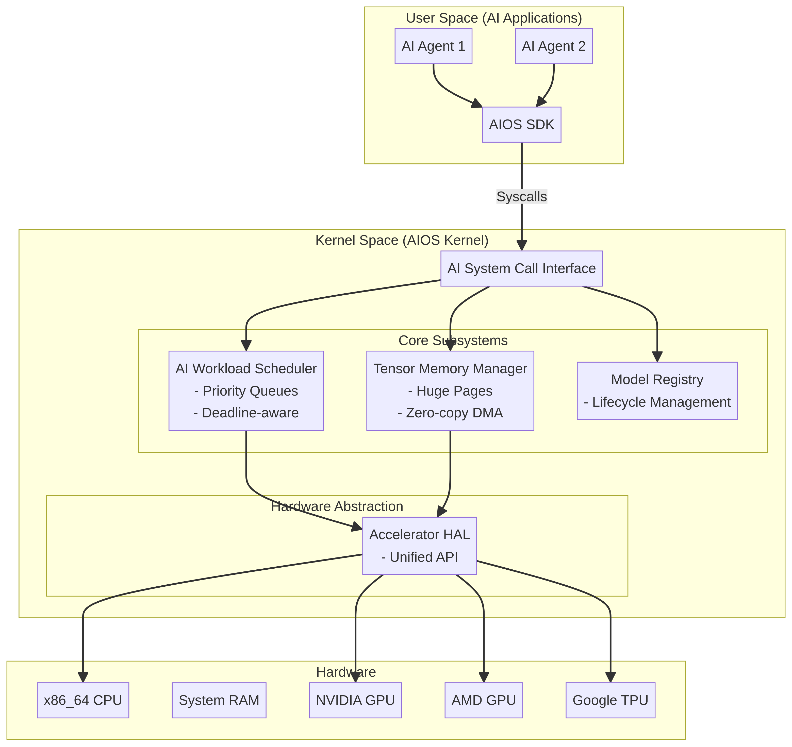

# AI-Native Operating System (AIOS) 커널 설계 문서

## 1. 개요
AIOS(AI-Native Operating System)는 인공지능(AI) 워크로드를 1급 시민(First-class citizen)으로 취급하여, 커널 레벨에서부터 AI 모델의 학습 및 추론을 최적화하도록 설계된 실험적인 x86_64 베어메탈 운영체제입니다. 기존의 범용 OS가 파일 시스템과 프로세스 스케줄링에 초점을 맞추었다면, AIOS는 텐서 메모리 관리, AI 가속기 추상화, 그리고 모델 추론/학습을 위한 전용 스케줄러에 집중합니다.

## 2. 핵심 설계 원칙
- **AI-Native 아키텍처**: 시스템 콜, 메모리 관리, 스케줄링이 모두 AI 작업(텐서 연산, 모델 추론 등)을 중심으로 설계되었습니다.
- **텐서 중심 메모리 관리**: 페이지 기반이 아닌 텐서/버퍼 중심의 메모리 할당을 통해 SIMD/AVX 연산에 최적화된 메모리 정렬을 제공합니다.
- **가속기 추상화(HAL)**: 다양한 AI 가속기(GPU, TPU, NPU 등)를 단일 인터페이스로 관리하여 하드웨어 종속성을 제거합니다.

## 3. 커널 아키텍처
AIOS 커널은 다음과 같은 핵심 서브시스템으로 구성됩니다.



### 3.1. 텐서 메모리 관리자 (Tensor Memory Manager)
기존 OS의 페이지 기반 메모리 관리 대신, AI 워크로드의 특성에 맞춘 메모리 풀 기반 관리를 수행합니다.
- **메모리 풀 분리**: Tensor Pool, Model Pool, Inference Pool, DMA Pool 등 용도별로 메모리 영역을 분리하여 단편화를 방지합니다.
- **거대 페이지(Huge Page) 지원**: 모델 가중치 저장을 위해 2MB 거대 페이지를 사용하여 TLB 미스를 최소화합니다.
- **SIMD 최적화**: 모든 텐서 할당은 AVX-512 등 벡터 연산에 최적화되도록 64바이트 경계로 정렬됩니다.

### 3.2. AI 워크로드 스케줄러 (AI Workload Scheduler)
다단계 피드백 큐(Multi-level Feedback Queue)를 기반으로 하며, AI 작업의 특성에 따라 우선순위를 동적으로 조정합니다.
- **정책 기반 스케줄링**: 
  - `SCHED_POLICY_REALTIME`: 실시간 추론 (가장 높은 우선순위, 데드라인 기반)
  - `SCHED_POLICY_INFERENCE`: 일반 추론
  - `SCHED_POLICY_TRAINING`: 모델 학습 (배치 처리 최적화)
- **가속기 친화도(Affinity)**: 작업이 특정 GPU/가속기에 바인딩되도록 하여 데이터 이동 비용을 최소화합니다.

### 3.3. 가속기 하드웨어 추상화 계층 (Accelerator HAL)
PCI 버스를 스캔하여 시스템에 장착된 AI 가속기를 탐색하고 관리합니다.
- **통합 인터페이스**: `accel_matmul`, `accel_attention` 등 AI 핵심 연산을 추상화된 API로 제공합니다.
- **CPU Fallback**: 전용 가속기가 없는 경우 CPU의 SIMD(SSE/AVX) 명령어를 활용하는 Fallback 디바이스를 기본으로 제공합니다.

### 3.4. AI 시스템 콜 인터페이스 (AI Syscall)
사용자 공간의 AI 에이전트가 커널 서비스에 접근할 수 있도록 AI 특화 시스템 콜을 제공합니다.
- **모델 관리**: `SYS_MODEL_LOAD`, `SYS_MODEL_UNLOAD`
- **텐서 조작**: `SYS_TENSOR_CREATE`, `SYS_TENSOR_DESTROY`
- **추론 및 학습**: `SYS_INFER_SUBMIT`, `SYS_TRAIN_FORWARD`

## 4. 빌드 및 실행
AIOS 커널은 Multiboot2 규격을 준수하며, GRUB 부트로더를 통해 부팅됩니다.

```bash
# 커널 및 부팅 가능한 ISO 이미지 빌드
make all
make iso

# QEMU에서 실행
make run
```

## 5. 향후 발전 방향
현재 구현된 프로토타입을 기반으로 다음과 같은 기능 확장이 가능합니다.
- 실제 NVIDIA/AMD GPU를 위한 네이티브 커널 모듈 드라이버 구현
- 분산 학습을 위한 노드 간 RDMA 지원 통합
- 사용자 공간 AIOS SDK 및 Python 바인딩 제공
