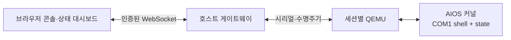
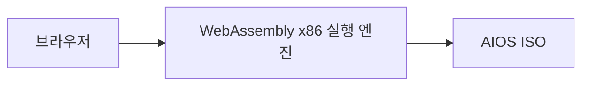
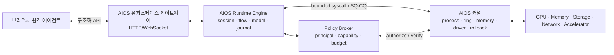

# AIOS 브라우저 콘솔과 자체 런타임 엔진 로드맵

> 기준일: 2026-07-25
> 관리축 재정렬: 2026-08-10
> 내용 검토일: 2026-09-13 — v0.10 Task와 브라우저 요구의 범위 대조; 브라우저 구현 검증 아님
>
> 문서 역할: W축 브라우저 전달 방식의 분야별 설계 가이드
> 문서 수명주기: 활성
> 아래 브라우저 기능은 별도 표시가 없는 한 `PLANNED` 또는 `RESEARCH`다. 전역 작업 큐를 소유하지 않는다.

[제품 목적](../meta/aios_product_direction_ko.md)은 AI가 자신의 공간·상태를 이해하고
효율적으로 활동하며 사용자와 지속적으로 상호작용하는 경험이다. 브라우저는 이 경험을
표현하는 선택지다. 기존 CLI와 구조화된 표면을 통한 첫 agent 소비·상호작용도 제품
개발이며, W1 구현을 그 선행조건으로 두지 않는다.

Kernel Room의 관리 의미는 [관리 모델](../kernel-room/kernel_room_management_model_ko.md),
전역 큐는 [작업흐름](../meta/minimal_io_and_maturity_workflow_ko.md#agent-consumer-next)을
따른다. W축의 완료가 K축이나 H축의 성숙도를 대신하지 않는다.
[신선도 원장](../meta/document_freshness_registry_ko.md)에서 내용·외부자료 검토 범위를 구분한다.

이 문서의 `Hosted Web Console`과 `Host Session Runtime`은 QEMU 세션을 중계·격리하는
W축이다. Linux 위에서 Kernel Room source adapter와 resource policy backend를 실행하는
H축은 의도된 기본 delivery runtime이며 정본은
[Linux-hosted substrate와 리소스 정책](linux_hosted_substrate_and_resource_policy_ko.md)이다.
W축은 그 runtime의 UI/session 표면이 될 수 있지만, 두 경로가 같은 host에서
결합되어도 성숙도와 완료 증거를 합치지 않는다.

## 1. 목적

AIOS를 브라우저에서 관찰하고 제어하는 가까운 경로와, 장기적으로 외부 QEMU
오케스트레이터에 의존하지 않고 AIOS 안의 유저스페이스 런타임이 서비스를
제공하는 경로를 분리해 정의한다.

이 문서의 W4에서 말하는 **native 자체 런타임 엔진**은 커널 안에 LLM을 넣거나 모델이
레지스터·포인터를 직접 생성하게 하는 기능이 아니다. 프로세스, AI flow,
모델 런타임, 정책 확인, 비동기 큐, 세션 복구를 묶는 AIOS 유저스페이스
서비스 계층을 뜻한다. 커널은 계속 결정론적 자원·권한·복구 경계를 담당한다.

## 2. 현재 출발점

아래 native 행과 별도 hosted 행은 실행 기반을 구분한다. 현재 Linux-hosted MAIN·
backend·CLI는 이미 제한적으로 동작하며, W4 native 서비스 모델의 부재와 혼동하지 않는다.

| 항목 | 상태 | 실제 범위 |
|---|---|---|
| QEMU 부팅과 COM1 로그 | `CURRENT` | testkit이 ISO를 부팅하고 시리얼 로그를 수집한다 |
| 시리얼 셸 | `CURRENT` | host가 `ping`, `state *`, `reboot`를 송수신할 수 있다 |
| 기계 판독 상태 | `CURRENT` | `[STATE] topic key=value`, `state room/binding/resource/autonomy`의 versioned read-only 표면 |
| Kernel Room K1 계층 | `CURRENT` | 1024B bounded Cell 1/Node 1/NodeBit 2 registry와 strict boot/shell 검증 |
| Kernel Room native K2-a 결속 | `CURRENT` | 별도 256B snapshot에서 Node 101과 producer-owned SLM MAIN source 결속; exact boot/summary/`state binding` 검증 |
| 셸 종료 판정 | `CURRENT` | reader drain, reboot ack, clean QEMU exit를 검증한다 |
| 커널 네트워크 | `PARTIAL` | e1000 bootstrap/smoke는 있으나 TCP/IP·소켓·HTTP 서버는 없다 |
| native 장기 실행 유저스페이스 | `PLANNED` | 현재 ring3는 PID 1→PID 2 정적 ELF의 bounded 순차 동기 실행이며, 선점 서비스 모델은 아니다 |
| 브라우저 콘솔·게이트웨이 | `PLANNED` | 아직 구현 파일이나 정규 검증 경로가 없다 |
| W4 native 자체 런타임 엔진 | `PLANNED` | K1과 bounded native K2-a는 완료됐으며, 남은 K2 lifecycle·K3~K5 관리·권한, M3~M5 실행·I/O, C1/C2 영속 기반 이후의 기능이다 |

Linux-hosted의 실제 MAIN·CLI·backend 수명은 `PARTIAL`이며 [hosted 도메인](../../hosted/README.md)과
[에이전트 운용 계약](../autonomy/agent_operating_contract_ko.md)을 따른다. 게시된 v0.7 단문 모델
질의에는 환경·이전 대화가 자동 주입되지 않았다. 현재 v0.10은 제한된 환경 문맥과
질문 UUID의 접수·조회·결과·명시적 취소를 연결한다(`PARTIAL`). 정확한 버전·source와
보존된 실제 문맥 소비·Task fixture 결과는 [환경 문맥 가이드](aios_space_context_guide_ko.md)를 따른다.
이전 대화·범용 작업 수정·CLI 소실/재부팅 뒤 자동 재개는 없다. 이 변경은 W1/W4
브라우저 기능의 완료 증거가 아니다. 실제 모델 Task의 한정 흐름은 PASS이며 source 39개 운영 이미지의
acceptance는 미완료다. 기존 운영 이미지와 이 개발 소스의 실행 범위를 구분한다.

native 커널을 브라우저에서 관찰할 경우에는 COM1 중계를 후보로 사용할 수 있다.
hosted 사용자 상호작용은 기존 제품 runtime의 공개 상태·요청 계약을 소비하는 별도
경로로 설계할 수 있다. 어느 경로도 이 문서의 존재만으로 다음 필수 구현이 되지 않는다.

## 3. 실행 모드

### 3.1 Hosted Web Console — native 관찰용 전달 후보

- AIOS 커널 변경 없이 시작할 수 있다.
- 브라우저는 raw host shell이나 QEMU monitor에 접근하지 않는다.
- 게이트웨이는 명령 allowlist, 세션 수명, 로그, 재부팅을 관리한다.
- 초기 명령은 `ping`, `state *`, `reboot`로 제한한다.
- 다중 사용자는 하나의 전역 셸을 공유하지 않고 QEMU 인스턴스를 분리한다.

### 3.2 Browser-local Execution Engine — 선택적 연구 트랙

- 서버 없이 브라우저 탭 안에서 AIOS ISO를 부팅하는 데모·교육용 모드다.
- Multiboot2, x86_64, 타이머, 시리얼, CPU 보안 기능 호환성을 별도로 검증해야 한다.
- QEMU 정규 검증과 같은 증거 계약을 통과하기 전에는 지원 플랫폼으로 선언하지 않는다.
- 자체 x86 에뮬레이터 개발은 핵심 제품 경로가 아니다. 기존 실행 엔진을 먼저
  평가하고, AIOS 고유 요구가 명확할 때만 독립 엔진을 연구한다.

### 3.3 AIOS Native Runtime Engine — 장기 제품 목표

이 모드에서는 QEMU가 있더라도 하드웨어 가상화 경계일 뿐 서비스 제어면이 아니다.
웹/API 서버, 에이전트 세션, 모델 실행, 기억과 flow 복구는 AIOS 유저스페이스가
소유한다. 실기기에서는 같은 런타임이 QEMU 없이 동작하는 것을 목표로 한다.

## 4. 단계별 계획

### W1. AIOS Web Console v0 — `PLANNED`, 독립 착수 가능

작업:

- QEMU COM1과 WebSocket 사이의 bounded gateway
- 부팅·중지·재부팅 상태 머신
- 브라우저 터미널과 `state` 카드
- 세션별 transcript, boot verdict, 종료 이유 보존
- 조회 명령 allowlist와 세션 인증; 소유 세션의 명시적 부팅·중지·재부팅 제어는 별도 상태 변경으로 구분

완료 조건:

- 브라우저에서 AIOS를 부팅하고 `state health`, `state autonomy`를 같은
  response record로 확인한다.
- 연결 종료·guest reboot·timeout·host failure를 구분한다.
- 브라우저 입력으로 host shell 또는 QEMU monitor에 도달할 수 없다.
- 기존 strict shell lane의 판정을 약화시키지 않는다.

### W2. Host Session Runtime — `PLANNED`

작업:

- 사용자·작업별 QEMU 인스턴스 격리
- 동시 실행 제한, CPU·RAM·시간 budget
- ISO/kernel hash와 QEMU/toolchain provenance
- 세션 재연결, artifact 조회, 실패 인스턴스 정리
- 구조화 `[EVT]`가 생기면 상태 스트림과 events artifact 연결

완료 조건:

- 두 세션의 시리얼·상태·artifact가 서로 섞이지 않는다.
- 서버 재시작 뒤 실행 중/종료 세션을 모호하게 성공으로 복원하지 않는다.
- 동일 이미지와 설정으로 재현 가능한 run manifest를 남긴다.

### W3. Browser-local Engine Pilot — `RESEARCH`

> 2026-08-03 조사 체크포인트: [v86](https://github.com/copy/v86)는 공식 README 기준
> 64-bit extensions를 지원하지 않으므로 현재 x86_64 AIOS ISO의 실행 후보가 아니다.
> 이번 조사에서는 요구를 충족한다고 공식 자료로 확인된 full-system browser engine을
> 찾지 못했다. 후보 미정 상태를 유지하고 32-bit 부팅이나 user-mode emulator를
> AIOS 호환으로 과장하지 않는다.

작업:

- 기존 WebAssembly x86 실행 엔진의 AIOS ISO 부팅 가능성 조사
- full/minimal profile의 부트·시리얼·타이머 호환성 표 작성
- QEMU와 동일한 필수 evidence 및 fatal verdict 적용
- 브라우저 메모리·CPU budget과 중단/재개 경계 정의

완료 조건:

- 지원 브라우저에서 정해진 profile이 반복 부팅된다.
- QEMU 결과와 다른 부분을 `UNSUPPORTED` 또는 명시적 capability로 기록한다.
- 데모 성공을 정규 하드웨어 검증으로 과장하지 않는다.

### W4. AIOS Native Runtime Engine — `PLANNED`

이 절의 선행 조건은 native 커널 위에서 동작하는 W4에 적용한다. Linux-hosted의
대화·환경 문맥·작업 진행 인터페이스 전체의 시작 조건으로 확대하지 않는다.

선행 조건:

- K1~K4 canonical Cell/Node/NodeBit hierarchy, source binding, read-only attribution
- K5 principal/ownership + Kernel Room Axis Gate authorize
- M3-b-3b2c 이상의 실제 다중 프로세스·선점 실행 기반
- M4 storage read와 M5 디스크 ELF 적재
- 안정적인 네트워크 데이터 경로와 최소 TCP/IP·소켓 계층

작업:

- `aios-init`이 유저스페이스 gateway와 runtime engine을 시작
- principal별 세션, resource ledger, AI flow 수명주기
- inference/storage/network용 bounded SQ/CQ
- 모델 런타임은 유저스페이스에서 실행
- 정책 제안과 commit 권한을 분리

완료 조건:

- 외부 호스트의 시리얼 명령 없이 AIOS가 자체 서비스를 시작한다.
- 브라우저가 구조화 API로 상태를 읽고 bounded AI job을 제출·취소한다.
- before/after 자원, authorize 결과, completion 또는 rollback 사유를 남긴다.

### W5. Self-hosted Continuity — `PLANNED`

선행 조건은 C1 정책·관리 저널과 C2 AI Flow다.

- 재부팅 뒤 미완료 세션과 flow를 식별한다.
- `APPLIED`지만 `COMMITTED`되지 않은 행동을 rollback 또는 검증 후 재개한다.
- 프로세스가 교체돼도 같은 flow ID로 모델 작업을 계속한다.
- 브라우저 재연결은 새 작업을 암묵적으로 만들지 않고 기존 세션을 명시적으로
  resume하거나 새 세션을 생성한다.

## 5. 보안 경계

1. 브라우저에 host shell, filesystem path, QEMU monitor를 직접 노출하지 않는다.
2. raw serial 문자열을 권한 증거로 신뢰하지 않는다.
3. W1은 조회 명령과 소유 세션의 명시적 부팅·중지·재부팅 제어를 구분한다. `reboot`는 read-only가 아니다. 세션 인증·소유 확인은 향후 커널 자원 action의 principal authorize나 policy generation을 대신하지 않는다.
4. 인스턴스별 CPU·RAM·시간·로그 크기 상한을 둔다.
5. WebSocket 연결과 AIOS principal을 같은 신원으로 간주하지 않는다.
6. 커널에 자유형 자연어, raw pointer, register, MMIO 주소를 전달하지 않는다.
7. 모델 실행·HTTP/WebSocket 처리는 커널이 아니라 유저스페이스에 둔다.

## 6. 검증 계약

- gateway protocol은 정상 응답, 중복 key, 잘린 record, 역순 종료, 재연결 반례를
  host unit test로 고정한다.
- 실제 QEMU 통합 테스트는 기존 boot verdict와 shell same-record 판정을 재사용한다.
- 브라우저 E2E는 부팅, state 카드, reboot, 비허용 명령 거절을 검사한다.
- 각 세션은 image hash, 명령, raw transcript, events, verdict, termination을 보존한다.
- W3/W4는 별도 capability matrix를 가지며 지원하지 않는 경로를 PASS로 바꾸지 않는다.

## 7. 로드맵 관계

| 축 | 관계 |
|---|---|
| 검증 V0~V5 | W1/W2의 verdict, artifact, provenance, structured event 기반 |
| 관리 K1~K4 | W4의 canonical Cell/Node/NodeBit, source binding, resource attribution 기반 |
| 정책 K5 | W4 원격 action의 principal/ownership authorize와 정책 단일 원본 |
| 실행 M3~M5 | W4의 프로세스, storage, disk ELF 선행 조건 |
| 지속성 C1~C2 | W5 세션·flow·정책 재개 기반 |
| Linux-hosted H0~H5 | 의도된 기본 delivery runtime이지만 W1/W2 QEMU session과 별도 성숙도. H2 source adapter의 raw/normalized/binding verdict를 Web Console 성공과 합치지 않음 |

W1은 현재 커널을 바꾸지 않고 독립적으로 시작할 수 있다. W4를 앞당기기 위해
커널 안에 임시 HTTP 서버나 자유형 action 우회를 넣지 않는다.

## 8. 비목표

- 브라우저 접근을 위해 커널에 임시 TCP/IP·HTTP 구현을 밀어 넣지 않는다.
- AI 모델을 ring0에 포함하지 않는다.
- QEMU를 대체하는 자체 x86 에뮬레이터를 단기 핵심 목표로 삼지 않는다.
- Web Console의 성공을 AIOS-native runtime 완성으로 표현하지 않는다.
- 단일 사용자 데모를 다중 tenant 격리로 표현하지 않는다.
