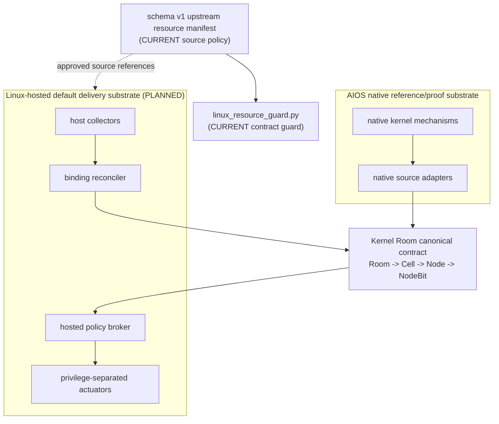

# AIOS Linux-hosted substrate와 upstream resource 정책 정본

> 기준일: 2026-08-23
>
> 문서 상태: 설계·resource 선정 정본
>
> Upstream resource policy: `CURRENT` (`schema_version=1`,
> `policy_id=aios-linux-substrate-resources-v0`, `resources=13`)
>
> 제품 delivery 방향: Linux-hosted userspace service
> (의도된 기본 경로로 결정; 구현 성숙도 표기가 아님)
>
> Linux-hosted backend 구현 성숙도: `PLANNED`

이 문서는 AIOS가 독자적인 Kernel Room 의미를 유지하면서 Linux-hosted userspace
service를 의도된 기본 delivery substrate로 구현할 때 사용할 **공식 upstream
기준선과 source-only 경계**를 정한다. 이 제품 방향 결정은 hosted backend의 구현
성숙도를 승격하지 않는다.

- 사람용 정책 정본: 이 문서
- 기계 판독 resource set 정본:
  `tools/platform/resources/linux_substrate_resources.json`
- 정규 guard:
  `py -3 tools/platform/linux_resource_guard.py`

resource manifest와 guard가 `CURRENT`라는 것은 승인된 upstream 기준선의 구조,
역할, 버전, 공식 source URL, license 문자열, provenance/artifact-pin 요구와 금지 상태를
checked-in 계약으로 검사한다는
뜻이다. Linux-hosted daemon, adapter, kernel module, resource actuator가 구현됐다는
뜻이 아니며, upstream 코드의 복사·수정·배포를 허가한다는 뜻도 아니다.

Kernel Room의 식별자와 구현 순서는
[Kernel Room 관리 모델](../kernel-room/kernel_room_management_model_ko.md)이 우선한다.
AIOS native resource ledger와 runtime policy의 구현 상태는
[AI 친화 리소스 관리 개발 계획](../autonomy/ai_resource_management_development_plan_ko.md)이
우선한다. 이 문서는 두 정본을 대체하지 않고 **외부 substrate 선정과 결속 경계**만
소유한다.

## 1. 결정

AIOS는 **Linux-hosted userspace service를 의도된 기본 delivery substrate로
채택한다.** Linux 자체를 Kernel Room의 정체성이나 canonical identity provider로
채택하지 않으며 아래 두 실행 경로의 역할을 분리한다.

1. **Linux-hosted backend**는 commodity driver, filesystem, network, process,
   model-runtime 생태계를 활용하는 기본 delivery 구현 경로다. 실행체와 정규
   verdict가 아직 없으므로 구현 성숙도는 `PLANNED`다.
2. **AIOS native kernel**은 작은 reference/proof substrate다. x86_64 실경로와
   Kernel Room 불변식을 직접 증명하고 hosted 경로의 conformance 기준을 제공한다.
3. 두 경로의 제품 정본은 동일한 `Room -> Cell -> Node -> NodeBit` 관리 계약이다.
4. Linux PID, cgroup, namespace, device ID는 canonical Cell/Node/NodeBit가 아니라
   namespace와 generation을 가진 **외부 source**다.
5. upstream resource의 등록은 source 조사만 허용한다. code import와 runtime support는
   각각 별도 승인·구현·검증을 요구한다.

따라서 이 방향은 Linux 커널 소스를 AIOS 커널에 복사하거나 AIOS를 Linux fork 또는
kernel module로 바꾸는 계획이 아니다. 첫 제품 경로는 Linux userspace service이고,
제품 의미는 substrate와 독립된 채 native proof와 hosted delivery가 같은 계약을
검증하는 구조다.

## 2. 현재 성숙도 경계

| 대상 | 상태 | 정확한 경계 |
|---|---|---|
| Linux substrate resource policy schema v1 | `CURRENT` | checked-in manifest와 guard가 exact field set, 필수 13개 row, role·version·source-only·`code_import=0` 계약을 검사 |
| 승인 upstream resource rows | `CURRENT` source metadata | `host_only=3 interface_only=5 reference_only=4 blocked_import=1`; 다운로드·vendoring·호환·실행 증거가 아님 |
| Kernel Room K1 hierarchy registry v0 | `CURRENT` | 1024B bootstrap Cell 1, bound Node 1, parent-bound typed NodeBit 2의 management-only proof |
| Native K2-a semantic oracle | `CURRENT` | 별도 256B snapshot에서 Node 101을 producer-owned SLM MAIN source에 boot-local immutable 결속 |
| Kernel Room 전체 topology | `PARTIAL` | K2-a 한 native binding만 있으며 lifecycle/reconcile, K3 projection, K4 attribution, K5 authorize는 전체 연결되지 않음 |
| AI resource ledger / pressure | `CURRENT` | native aggregate read-only 관측; hosted resource나 owner attribution 증거가 아님 |
| Native resource apply policy | 기존 정본을 따름 | upstream resource policy와 별도다. 이 문서가 native target/action의 성숙도를 바꾸지 않음 |
| Linux-hosted observation backend | `PLANNED` | daemon, source adapter, binding reconciler, 정규 runtime verdict가 없음 |
| Linux-hosted resource apply backend | `PLANNED` | support matrix, privilege separation, before/after proof, rollback verifier가 없음 |
| Cross-backend conformance lane | `PLANNED` | native/hosted가 같은 lifecycle trace를 통과하는 정규 artifact가 없음 |
| 다른 microkernel substrate | `RESEARCH` | 필요성과 이식 비용을 별도 실험으로 입증하기 전 제품 약속이 아님 |

`resource policy = CURRENT`는 이 문서와 schema v1 manifest/guard가 소유하는
**upstream resource curation policy**만 뜻한다. Kernel Room K4/K5, Linux process
adapter, cgroup enforcement 또는 AIOS native resource apply를 뜻하지 않는다.

## 3. 승인 upstream 기준선

| Resource | 역할 | 승인 series / 문서 | exact reference | 날짜·수명 | 사용 경계 |
|---|---|---|---|---|---|
| Linux kernel primary | Linux-hosted 설계·호환의 주 기준선 | `6.12.y` LTS | `6.12.104` | 2026-08-19, EOL 2028-12 | 기본 API·동작 조사 기준; source-only |
| Linux kernel secondary | 더 새 series의 전방 호환성 비교 | `6.18.y` | `6.18.45` | manifest의 provenance를 따름 | primary를 조용히 대체하지 않는 비교 기준; source-only |
| QEMU | 계획된 Linux-hosted/QEMU lane의 emulator source reference | `11.1.x` | `11.1.0` | 2026-08-11 | 정식 release만 허용, RC 금지; runtime qualification과 hosted lane은 여전히 `PLANNED` |
| VirtIO selected implementation baseline | 보수적 구현·검증 기준 | `1.2 CS01` | `1.2-CS01` | manifest의 OASIS source URL | AIOS가 선택한 승인 구현 기준 |
| VirtIO newer approved reference | 최신 차이 조사 | `1.4 CS01` | `1.4-CS01` | 2026-04-08 승인 | `RESEARCH` only; 1.2 selected baseline을 조용히 대체하지 않음 |

### 3.1 Primary와 secondary의 의미

- 새 hosted 설계는 Linux `6.12.y` LTS를 먼저 설명하고 검증한다.
- `6.12.104`은 현재 exact reference다. `6.12.y`라는 움직이는 branch 이름만으로
  재현성이나 검증 완료를 주장하지 않는다.
- `6.18.45`는 secondary comparison reference다. 새 API 탐색이나 향후 이동 비용을
  평가할 수 있지만, 별도 결정 없이 primary support baseline이 되지 않는다.
- 두 Linux row를 동시에 등록해도 두 series를 runtime에서 지원한다는 뜻이 아니다.

### 3.2 QEMU release 규칙

- 계획된 Linux-hosted lane의 source reference series는 `11.1.x`, exact reference는
  `11.1.0`이다. 2026-08-15 공식 release 재검토에서 이전 exact pin을 대체했으며 이 갱신은
  아직 없는 hosted runtime의 qualification이나 support 승격이 아니다.
- release candidate, preview, nightly, branch tip은 canonical lane에 넣지 않는다.
- RC를 검토할 필요가 있으면 별도 `RESEARCH` row와 비정규 artifact로만 다루며,
  stable verdict나 baseline을 갱신하지 않는다.

### 3.3 VirtIO selected baseline·최신 reference 분리

- `VirtIO 1.2 CS01`은 AIOS가 선택한 보수적 implementation baseline이다.
- `VirtIO 1.4 CS01`은 2026-04-08 승인된 더 최신 specification이지만 현재 AIOS에서는
  `reference_only`·`RESEARCH` 비교 기준이다.
- 1.4에만 있는 기능을 사용하거나 1.2와 다른 해석을 채택하려면 capability와
  research lane을 따로 만들고, 1.2 baseline을 통과한 것으로 축약하지 않는다.

### 3.4 2026-08-23 exact reference 재검토

- [kernel.org signed release index](https://www.kernel.org/pub/linux/kernel/v6.x/)에서
  primary exact pin을 `6.12.103`에서 `6.12.104`로, secondary exact pin을
  `6.18.44`에서 `6.18.45`로 갱신했다(각각 2026-08-19 signed longterm release).
  이는 source reference 갱신일 뿐 runtime qualification이나 support 승격이 아니다.
- [QEMU 공식 download page](https://www.qemu.org/download/)에서 `11.1.0`(2026-08-11)이
  여전히 최신 stable release임을 재확인했다. exact pin 변경 없음.
- [OASIS VIRTIO TC page](https://www.oasis-open.org/committees/virtio/) 기준 승인된
  최신 committee specification 변동 없음. `1.2-CS01` selected baseline과
  `1.4-CS01` RESEARCH row를 유지한다.
- 같은 패치에서 manifest row, guard REQUIRED_RESOURCES/digest, 이 문서 표를 함께
  갱신했고 `linux_resource_guard.py` PASS를 확인했다.

## 4. Resource manifest와 guard 계약

### 4.1 기계 판독 정본

`tools/platform/resources/linux_substrate_resources.json`은 schema v1의 canonical
resource set이다. 문서가 manifest와 충돌하면 버전·role·source identity 같은
기계 판독 필드는 manifest를 먼저 확인하고, 같은 패치에서 문서 또는 manifest의
오류를 명시적으로 고친다.

Top-level exact field set은 아래 일곱 개다.

```text
schema_version
policy_id
reviewed_on
canonical_document
resource_policy_maturity
hosted_backend_maturity
resources
```

각 resource row의 exact field set은 아래 열일곱 개다. 누락뿐 아니라 새 unknown
field도 schema v1 guard에서 실패한다.

```text
id
kind
disposition
version_policy
version
reference_pin
source_url
license
code_import
boundary
identity_semantics
aios_role
maturity
update_policy
provenance_required
artifact_pin_required
block_reason
```

현재 13개 필수 row의 분류는 다음과 같다.

| ID | kind | disposition | maturity | identity |
|---|---|---|---|---|
| `linux-host-primary` | `host_kernel` | `host_only` | `PLANNED` | `none` |
| `linux-host-forward` | `host_kernel` | `host_only` | `PLANNED` | `none` |
| `qemu-system-linux-host` | `emulator` | `host_only` | `PLANNED` | `none` |
| `linux-kvm-uapi` | `hypervisor_uapi` | `interface_only` | `PLANNED` | `none` |
| `virtio-1-2-contract` | `virtual_device_spec` | `interface_only` | `PLANNED` | `none` |
| `virtio-1-4-reference` | `virtual_device_spec` | `reference_only` | `RESEARCH` | `none` |
| `linux-cgroup-v2-source` | `host_observation_api` | `interface_only` | `PLANNED` | `source_only` |
| `linux-pidfd-source` | `host_observation_api` | `interface_only` | `PLANNED` | `source_only` |
| `linux-psi-source` | `host_observation_api` | `interface_only` | `PLANNED` | `source_only` |
| `linux-kernel-internal-source` | `kernel_internal_api` | `blocked_import` | `RESEARCH` | `none` |
| `sel4-design-reference` | `reference_kernel` | `reference_only` | `RESEARCH` | `none` |
| `zircon-design-reference` | `reference_kernel` | `reference_only` | `RESEARCH` | `none` |
| `unikraft-design-reference` | `reference_runtime` | `reference_only` | `RESEARCH` | `none` |

Disposition 합계는 `host_only=3`, `interface_only=5`, `reference_only=4`,
`blocked_import=1`, `import_candidate=0`이다. 모든 row는 `code_import=false`,
`provenance_required=true`, `artifact_pin_required=true`다. Linux userspace observation
세 row만 `identity_semantics=source_only`이고, 나머지는 `none`이다.

Manifest row가 증명하는 것은 아래로 제한한다.

- 어떤 upstream project와 artifact를 참고 대상으로 승인했는가
- `host_only`, `interface_only`, `reference_only`, `blocked_import` 중 역할은 무엇인가
- exact reference, 공식 source URL, provenance/artifact-pin 요구는 무엇인가
- `license`, 공식 HTTPS `source_url`, exact `version/reference_pin`,
  `provenance_required`, `artifact_pin_required`, `code_import`가 schema 계약을 만족하는가
- RC나 mutable reference처럼 정책이 금지한 상태가 섞이지 않았는가

Manifest row가 증명하지 않는 것:

- archive가 다운로드됐거나 local source tree가 존재함
- upstream code가 AIOS에 import·vendoring·link됐음
- AIOS가 해당 Linux/QEMU/VirtIO 조합에서 부팅·동작함
- license compatibility 법률 검토가 끝났거나 code import가 승인됨
- Linux object가 canonical Cell/Node/NodeBit로 결속됨

### 4.2 정규 guard

저장소 루트에서 다음 명령을 사용한다.

```powershell
py -3 tools/platform/linux_resource_guard.py
```

정상 terminal verdict는 정확히 다음 한 행이다.

```text
[LINUX-RESOURCE] PASS schema=1 resources=13 host_only=3 interface_only=5 reference_only=4 blocked_import=1 import_candidate=0 code_import=0 hosted_backend=PLANNED
```

Host negative test는 다음 명령으로 실행한다.

```powershell
py -3 -m unittest discover -s tools/platform/tests -p "test_*.py" -v
```

Guard의 exit code와 exact PASS 행은 schema v1 resource set의 정규 증거다. Guard는
exact top-level/resource field set과 13개 required resource의 승인된 kind,
disposition, version policy, exact version/pin, 공식 URL, license, boundary, identity,
maturity와 설명·업데이트·차단 사유의 full-row contract를 결속하고, HTTPS host
allowlist, block reason, provenance/artifact-pin 요구를
fail-closed로 검사한다.
모든 `code_import`는 반드시 `false`이고, root `LICENSE/COPYING/NOTICE` 정책이 없는
현재 상태뿐 아니라 schema v1 전체에서 `import_candidate`도 전면 거부한다. 빈 license
파일 하나는 이 차단을 해제하지 않으며, 향후 import 검토에는 새 schema와 명시적인
license/SPDX/provenance 정책이 필요하다. Guard가 통과해도 hosted backend
구현, artifact 다운로드, hash 검증, license compatibility 판단 또는 code import
승인이 생기지는 않는다.

같은 guard와 host negative tests는 `.github/workflows/linux-boot-check.yml`의
Ubuntu/Windows `os-tools-matrix`에서 정규 실행한다.

Resource row 또는 이 정책을 바꿀 때는 최소한 아래를 함께 확인한다.

1. manifest diff와 exact upstream identity
2. 이 문서의 기준선 표와 역할 설명
3. guard exit 0과 terminal output
4. Markdown link 검사와 `git diff --check`
5. code import를 제안했다면 §10의 별도 import gate

## 5. Linux identifier는 source일 뿐이다

향후 hosted adapter는 최소한 다음 의미를 분리해야 한다.

```text
host_instance
source_namespace
source_id
source_generation
canonical_kind
canonical_id
canonical_generation
observed_at
validity_flags
```

이것은 hosted runtime의 계획 계약이며 schema v1 upstream resource manifest의 row
형식이 아니다. runtime wire schema와 public numeric ID는 아직 `PLANNED`다.

| Linux 후보 | 허용되는 의미 | 금지되는 해석 |
|---|---|---|
| PID/TGID/pidfd 계열 | process source와 수명주기 관측 후보 | `PID == canonical Node ID` |
| cgroup 계층·kernel object 식별자 | workload-group source와 resource counter 후보 | `cgroup == Cell` |
| namespace/container/session ID | 격리·배포 source metadata 후보 | AIOS principal 또는 Cell owner |
| PSI/cgroup CPU·memory·I/O counter | pressure/resource observation 후보 | NodeBit eligibility 또는 authorize 결과 |
| sysfs/device identity | device source와 capability 후보 | canonical NodeBit ID 또는 raw apply 권한 |
| host boot identity | 모든 source generation의 상위 수명 경계 | Room generation 자체 |

PID 재사용, cgroup 삭제 뒤 같은 경로 재생성, host reboot, collector 재시작은 이전
binding을 자동 복원하지 않는다. source generation이나 host instance가 달라지면 stale로
거부하고, 명시적 reconcile 뒤 증가한 binding generation으로 다시 결속한다. canonical
generation은 target lifecycle이 별도로 바뀐 경우에만 변경한다.

## 6. 계획 구조



Manifest/guard의 CURRENT 상태와 점선 아래 hosted runtime의 PLANNED 상태를 합치지
않는다. Resource catalog는 구현 dependency graph나 package manager가 아니다.

### 6.1 Canonical plane

Canonical plane이 소유하는 것:

- Cell, Node, NodeBit의 typed ID와 append-only namespace
- exact parent binding과 canonical generation
- source namespace, source ID, source generation, validity
- lifecycle과 stale/duplicate/orphan 거부 규칙
- backend capability와 policy generation의 재검증 규칙

Canonical plane이 소유하지 않는 것:

- Linux task, cgroup, namespace, file descriptor, BPF map의 mutable 원본
- AIOS scheduler, allocator, ring, driver 내부 배열과 lock
- 자연어 plan, raw shell command, pointer, register 또는 MMIO 주소
- backend마다 다른 실패를 하나의 공통 성공으로 축약하는 로직

### 6.2 Native reference/proof substrate

Native 경로는 현재 AIOS kernel과 QEMU/실기기 경계를 유지한다. Linux resource
기준선을 추가하기 위해 native ABI, K1 snapshot, 기존 boot marker를 변경하지 않는다.
제품 delivery 우선순위가 Linux-hosted로 이동해도 native 경로는 canonical 의미를
substrate와 독립적으로 검증하는 bounded semantic oracle과 conformance proof로 남는다.

### 6.3 Linux-hosted default delivery substrate

첫 hosted 구현은 Linux kernel module이 아니라 userspace service로 시작한다.

- 관측 collector와 binding reconciler는 read-only로 먼저 완성한다.
- 권한이 필요한 actuator는 policy broker와 별도 process/권한 경계에 둔다.
- cgroup, procfs, sysfs, pressure, process lifetime 표면은 source 후보일 뿐이다.
- eBPF를 사용하더라도 보조 관측 source이며 canonical identity나 authorize
  verdict의 단일 원본이 아니다.
- 특정 init system, container runtime, 배포판의 내부 ID를 canonical ABI로 넣지
  않는다.

## 7. Hosted 구현 단계

### H0. Upstream resource 선정과 guard — `CURRENT`

- schema v1 manifest가 §3 기준선을 기계 판독 row로 고정한다.
- guard가 exact reference, role, source-only/import 금지 경계를 fail-closed로 검사한다.
- 이 완료는 hosted executable, runtime adapter 또는 AIOS support가 아니다.

### H1. OS-neutral trace와 replay verifier — `PARTIAL` (H1-a 완료, 2026-08-23)

- 세부 field, state machine, fixture와 검증 일정은
  [H1 trace/replay 작업 준비서](h1_binding_trace_replay_workplan_ko.md)를 따른다.
- H1-a(2026-08-23): `hosted/contracts/binding-trace-v1.contract.json`과
  `tools/hosted/binding_trace_replay.py` transport verifier가 `PARTIAL`로 착수됐다.
  transport·구조 verdict만 있고 semantic replay는 없다.
- H1-b lifecycle replay/fixture matrix, H1-c CI/artifact 연결이 남아 있고 이들이
  끝나기 전까지 H1을 `CURRENT`로 표기하지 않는다.
- `discover -> bind -> observe -> update -> stale reject -> rebind -> observe -> exit -> stale reject -> rediscover -> rebind -> observe`
  lifecycle을
  versioned trace로 고정한다.
- duplicate, orphan, source identity/instance reuse without valid generation,
  source-generation rollback, host-instance mismatch,
  missing validity를 fail-closed로 거부한다.
- bounded native K2-a의 semantic field/reject proof를 입력으로 OS-neutral schema와
  negative fixture를 고정한다. H1 뒤 native/hosted replay producer가 같은 semantic
  verdict를 소비하게 한다.

### H2. Linux observe-only adapter — `PLANNED`

- H1의 공통 lifecycle/generation/reject 계약, negative fixture와 하나의 bounded
  native semantic oracle가 모두 고정된 뒤 시작한다. native oracle은 2026-08-15
  `CURRENT`가 됐고 H1은 H1-a transport 조각(2026-08-23)만 `PARTIAL`이다. 광범위한 native process/storage
  확장과 최종 conformance closure는 첫 observe-only slice의 선행조건이 아니다.
- primary Linux baseline 위에서 한 host instance와 bounded process source를 관측한다.
- 실제 file/network/compute workload의 resource와 pressure source를 읽는다.
- canonical ID는 adapter가 받은 binding으로만 사용한다.
- mutation과 privileged actuator는 포함하지 않는다.

### H3. Binding reconciliation — `PLANNED`

- process exit, PID reuse, cgroup recreate, host reboot를 서로 구분한다.
- binding lease/generation과 source validity를 갱신한다.
- stale source가 이전 canonical Node에 다시 붙는 것을 거부한다.

### H4. Proposal/validation parity — `PLANNED`

- versioned resource request/result를 parse한다.
- hosted capability matrix에서 모든 action을 먼저 validate-only로 실행한다.
- unsupported, unowned, stale, out-of-range 요청은 apply 전에 거부한다.

### H5. 단일 bounded apply와 rollback — `PLANNED`

- native와 의미가 겹치는 한 target/action만 별도 승인한다.
- privilege-separated actuator, before/after evidence, timeout, rollback을 묶는다.
- 성공 경로보다 partial apply와 rollback failure 증거를 먼저 고정한다.

H5 완료 전 hosted backend를 resource enforcement, Kernel Room K5 authorize,
production sandbox로 표현하지 않는다.

## 8. Hosted resource action 경계

Hosted backend의 초기 capability matrix는 전부 `UNSUPPORTED`로 시작한다. H0의
resource catalog 통과나 H1/H2 관측 성공만으로 Linux cgroup 또는 scheduler에 action을
연결하지 않는다. 첫 apply action은 아래 조건을 모두 만족하는 한 종류만 연다.

1. canonical target의 Cell/Node binding과 generation이 유효하다.
2. 요청 principal과 target ownership을 별도 verifier가 확인한다.
3. backend가 해당 target/action을 명시적으로 `SUPPORTED`로 선언한다.
4. precondition snapshot과 bounded parameter가 있다.
5. apply 성공 뒤 같은 source generation의 postcondition을 읽는다.
6. rollback 가능하거나 실패 시 더 안전한 fail-stop/degraded 상태가 정의돼 있다.
7. timeout, partial apply, stale state, rollback failure가 서로 다른 reason으로 남는다.

Pressure, eligibility, action policy는 계속 분리한다.

- pressure는 혼잡과 중첩을 관측하는 순위 입력이다.
- eligibility는 현재 후보 가능성을 표현하는 NodeBit 축이다.
- action policy는 검증된 대상에 bounded transition을 요청하는 계약이다.

낮은 pressure를 authorize로, 높은 pressure를 자동 throttle로 해석하지 않는다.
Linux PSI나 cgroup counter를 읽게 되더라도 이 세 축을 합치지 않는다.

## 9. 4~8주 기본 delivery 구현 계획

Linux-hosted를 기본 delivery로 삼는 제품 방향은 이미 결정됐다. 아래 일정과 게이트는
채택 여부를 다시 고르는 실험이 아니라, 아직 `PLANNED`인 backend를 정직하게 구현하고
지원 가능 상태로 승격하기 위한 evidence plan이다.

| 기간 | 구현 조각 | 종료 증거 |
|---|---|---|
| 시작점 | 방향·도메인·H0 기준선 잠금 | `hosted/` 책임 경계, userspace process 원칙, guard PASS와 13개 source row; runtime 증거는 아님 |
| 1주차 | bounded native K2-a semantic oracle — 완료 (2026-08-15) | semantic kind, typed namespace, producer-owned instance/generation, copied read API, 별도 256B binding snapshot과 exact native reject proof; lifecycle trace 계약은 H1 |
| 1~2주차 다음 | H1 OS-neutral trace/replay verifier | update 뒤 stale/rebind와 exit 뒤 stale/rediscover/rebind를 분리하고 stable reason과 native oracle trace의 동일 verdict를 검증 |
| 2~4주차 | H2 Linux observe-only userspace service | primary exact reference에서 한 host와 한 `AI_SERVICE` source를 관측하고 raw/normalized/binding artifact를 분리; 모든 action `UNSUPPORTED` |
| 4~6주차 | H3 reconciliation과 parity | exit/PID reuse/cgroup recreate/collector restart/host reboot 구분, 명시적 rebind, backend ID leakage 없음 |
| 6~8주차 | delivery acceptance와 native conformance | service startup/restart/remove, 실제 storage/network/model workload, exact kernel/config/package/hash provenance, 정규 host matrix와 cross-backend verdict |

기본 작업 용량은 `SEMANTIC SAFETY K2/H1 40%`, `HOSTED DELIVERY H2/H3 50%`,
`H0 PROVENANCE + NATIVE CONFORMANCE 10%`로 둔다. Secondary Linux나 새 API 비교는
마지막 10% 안의 non-blocking research로만 다루며 primary baseline을 바꾸지 않는다.
어느 단계든 종료 증거가 실패하면 다음 단계나 maturity 승격을 중단하고 해당 계약으로
되돌아간다.

H4/H5, quota, throttle, scheduler migration, Axis Gate apply는 이번 4~8주 범위가
아니다. K5 principal/ownership/authorize 증거와 별도 승인이 생긴 뒤에만 다시 후보가
된다.

### 9.1 K2-a substrate-neutral source 규칙

K2 계약은 특정 substrate가 아니라 canonical `AI_SERVICE` 의미를 먼저 고정한다.
K1 Node 101과 결속할 source는 semantic kind, typed namespace, producer-owned
instance/generation과 copied read API를 가져야 한다.

- Native reference source는 exact-one active/persistent SLM agent-tree MAIN으로
  구현됐다. 전용 boot-local instance/generation과 copied 64B source snapshot을
  사용하며 `policy_generation`이나 timestamp를 source generation으로 재해석하지 않는다.
- Hosted source는 실제 Linux userspace service가 소유하는 명시적인 service
  instance/generation record다. PID, pidfd, cgroup, PSI는 그 service의 lifecycle과
  resource evidence일 뿐 canonical Node identity가 아니다.
- Memory Fabric main domain은 Cell/resource source 후보이고 bootstrap process는
  execution-instance source 후보다. 숫자나 구현 편의만으로 Node 101에 결속하지 않는다.

native K2-a는 K1과 분리된 schema 1/256B bounded binding snapshot, append-only
reject reason, exact marker/summary/`state binding`으로 검증된다. Hosted adapter는
동일한 semantic field/reason과
missing/duplicate/orphan/role-mismatch/zero/regressed/stale-generation 반례를
통과해야 한다. 기존 K1 1024B immutable snapshot은 변경하지 않는다. 작은 native
adapter는 Linux 의미가 canonical schema를 지배하지 못하게 하는 `CURRENT` semantic
oracle이다. 다만 refresh/exit/recreate/rebind는 아직 없으므로 K2 전체는 `PARTIAL`이다.
광범위한 native process/storage 확장은 H2 착수 조건이 아니지만 H1 lifecycle trace와
negative fixture는 H2보다 먼저 고정한다.

다음 readiness gate를 모두 통과해야 hosted backend를 지원됨 또는 배포 가능 상태로
승격할 수 있다.

1. **Resource gate:** manifest/guard가 primary, secondary, canonical, experimental
   역할을 혼동 없이 고정한다.
2. **Semantic gate:** backend와 무관한 canonical schema, generation, validity와
   stable reject reason이 먼저 정의된다.
3. **Replay gate:** H1이 정상 lifecycle과 negative fixture를 같은 verdict로
   fail-closed 판정한다.
4. **Isolation gate:** cgroup/PID/path가 Cell/Node ID로 새지 않는다.
5. **Product gate:** hosted lane이 장기 service와 실제 storage/network/model workload를
   관측해 사용자 가치를 만든다.
6. **Conformance/reversibility gate:** native와 hosted raw evidence는 달라도 semantic
   verdict가 같고, 어느 adapter를 제거해도 K1 ABI나 공통 protocol이 재정의되지 않는다.
7. **Safety gate:** 이번 주기에는 apply edge가 없으며 모든 action capability는
   `UNSUPPORTED`다.
8. **Maintenance gate:** upstream API, provenance, license, EOL, update 책임이 기록된다.

Linux 의미가 canonical record를 바꾸거나 backend별 verifier가 서로 다른 성공 의미를
갖게 되면 배포와 maturity 승격을 중단하고 H1 계약부터 다시 고친다. 이 실패가 이미
결정된 제품 방향을 구현 완료로 둔갑시키는 근거가 되어서는 안 된다.

## 10. Code import와 공급망 경계

Source resource row는 code import 승인이 아니다. 외부 코드를 복사, vendoring, 번역,
생성, patch 또는 link하는 제안은 아래가 모두 증명될 때까지 차단한다.

- exact upstream project, 공식 URL, immutable revision, integrity identity
- 저장소의 명시된 compatibility 정책에 따른 license review
- 필요한 SPDX, copyright, NOTICE 보존
- upstream material에서 각 imported/derived file까지 이어지는 provenance
- bounded destination, owner, update, security response, rollback 계획
- 변경 경로에 맞는 code review와 검증

어느 하나라도 unknown 또는 `PLANNED`면 source-only나 design-only로 되돌린다.
Guard PASS는 위 법률·기술 검토를 대신하지 않는다.

Resource 기준선 갱신은 다음을 따른다.

1. 움직이는 branch 이름이 아니라 exact stable release를 추가한다.
2. 공식 release와 EOL 정보를 확인한다.
3. manifest와 이 문서의 role/버전을 같은 패치에서 갱신한다.
4. guard를 통과하고 old exact reference의 잔존·모순을 검색한다.
5. hosted runtime baseline을 바꾸는 경우 기존 artifact와의 comparability를 별도 판정한다.
6. primary 교체는 secondary row 추가와 다르므로 명시적 방향 결정을 요구한다.

## 11. 실패와 검증 규칙

- manifest missing, malformed, schema mismatch, unknown field는 fail-closed다.
- duplicate resource identity, role 충돌, 금지된 RC/mutable reference는 실패다.
- version/reference pin, 공식 source URL, license, provenance/artifact-pin 필수값 누락을
  빈 값으로 통과시키지 않는다.
- official resource row와 experimental row의 지원 의미를 합치지 않는다.
- 권한 부족, source 미지원, 미관측 runtime 값은 `0` 성공값이 아니다.
- collector 종료나 host reboot 뒤 이전 binding을 암묵적으로 재사용하지 않는다.
- apply 결과가 모호하면 성공으로 추정하지 않고 target을 degraded/quarantined로 둔다.
- raw Linux error text는 진단 정보일 뿐 stable reason ID를 대신하지 않는다.

Hosted runtime이 생기면 raw source observations, normalized records, canonical binding
trace, request/result, before/after/rollback evidence, backend provenance, final verdict를
분리해 보존한다. Native와 hosted의 raw evidence는 달라도 canonical semantic verdict는
같아야 한다. 한 backend가 지원하지 않는 action은 parity 실패가 아니라 명시적
`UNSUPPORTED`다.

## 12. 문서 동기화

이 문서의 상태나 upstream 기준선을 바꿀 때 최소한 아래를 함께 확인한다.

- `docs/README.md` — 문서 색인
- `docs/os/browser_console_and_runtime_engine_roadmap_ko.md` — hosted web console/QEMU와
  Linux-hosted backend의 용어 분리
- `docs/autonomy/ai_resource_management_development_plan_ko.md` — native resource
  ledger/action policy와 upstream resource policy의 구분
- `docs/meta/minimal_io_and_maturity_workflow_ko.md` — K2~K5 및 별도 hosted H축 관계
- `docs/kernel-room/kernel_room_management_model_ko.md` — source binding과 K4/K5 성숙도
- `hosted/README.md` — 기본 delivery runtime의 제품 책임과 의존 경계
- `tools/platform/resources/linux_substrate_resources.json` — exact machine-readable
  resource set

Hosted 코드가 통합될 때는 루트 `README.md`, `CLAUDE.md`, `PROJECT.md`와 runtime
producer, protocol, verifier mirror까지 같은 구현 패치에서 동기화한다. Resource
manifest/guard만으로 그 문서들의 runtime 성숙도를 선행 승격하지 않는다.

## 13. 비목표

- Linux PID, cgroup, namespace를 canonical Cell/Node/NodeBit로 재명명하기
- Linux scheduler/cgroup/eBPF를 Kernel Room 자체로 부르기
- Resource manifest 등록을 code import, runtime support 또는 license 승인으로 표현하기
- Linux primary/secondary row를 동시 runtime 지원으로 표현하기
- QEMU RC를 canonical lane에 사용하거나 VirtIO 1.4 CS01 `RESEARCH` row를 1.2
  selected implementation baseline으로 조용히 승격하기
- H1/H2 관측 성공을 hosted apply 또는 production isolation으로 표현하기
- Linux-hosted 기본 delivery 결정을 Linux kernel source import, AIOS native
  reference/proof kernel 폐기, Linux fork/kernel module 또는 검증된 production
  지원으로 확대 해석하기
- 여러 backend의 지원 action 합집합을 공통 지원 범위로 표현하기
- Orbit나 분산 Cell mesh를 hosted 구현의 선행 목표로 끌어오기
